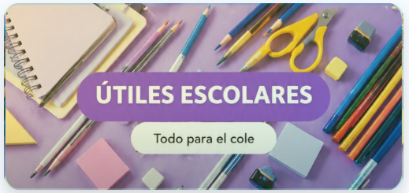

# Coki Librería

## Integrantes

- **Nahum Saravia** — @Nahum-Saravia
- **Sofía Sánchez** — @sofisanchez126
- **Juan Cruz Carrer** — @juancarrer11

---

## Descripción breve

**Coki Librería** es un proyecto desarrollado para organizar y automatizar la gestión de una librería, especialmente los pedidos de impresiones, las consultas de clientes y el control de stock.

El sistema busca facilitar la identificación y seguimiento de pedidos, evitar la acumulación de impresiones no retiradas y mejorar la atención al cliente.

---

## Páginas del proyecto

| Página | Contenido |
|---|---|
| `MenuPrincipal.html` | Página de inicio |
| `libreria.html` | Productos y útiles escolares |
| `impresiones.html` | Solicitud de impresiones |
| `consultarpedido.html` | Consulta de pedidos |
| `SesionUsuario.html` | Inicio de sesión del cliente |
| `SesionAdmin.html` | Inicio de sesión del administrador |

---

## Tecnologías utilizadas

### HTML5

Se utilizó HTML5 semántico con etiquetas como `header`, `nav`, `main`, `section`, `article`, `footer` y `form`.

### CSS3

Se utilizaron:

- Variables CSS.
- Flexbox.
- CSS Grid.
- Media Queries.
- Unidades relativas.
- `clamp()`.
- Responsive Design.

### Google Fonts

- **Fredoka** para títulos.
- **Nunito** para textos.

### Git y GitHub

Se utilizaron ramas, commits y Pull Requests para el trabajo colaborativo.

---

## ¿Dónde utilizamos Flexbox?

Flexbox se utilizó para organizar y alinear elementos en diferentes partes del sitio:

- **Header y navegación:** distribución de los enlaces.
- **Barra de aplicación:** organización del logo, menú y carrito.
- **Formularios:** alineación de los elementos.
- **Footer:** distribución y centrado del contenido.

Ejemplo:

```css
display: flex;
align-items: center;
gap: ...;
```

---

## ¿Dónde utilizamos Grid?

CSS Grid se utilizó específicamente en diferentes páginas del proyecto.

### `MenuPrincipal.html`

Se utilizó Grid en la **sección de categorías**, donde se muestran las tarjetas de:

- Útiles escolares.
- Impresiones.
- Consultas de pedidos.

```css
display: grid;
grid-template-columns: repeat(auto-fit, minmax(220px, 1fr));
```

Esto permite organizar las tarjetas en columnas y adaptar su distribución al espacio disponible.

### `libreria.html`

Se utilizó Grid en el **listado de productos**, organizando los productos en filas y columnas.

```css
grid-template-columns: repeat(auto-fill, minmax(220px, 1fr));
```

La cantidad de columnas se adapta según el ancho disponible.

### `consultarpedido.html`

Se utilizó Grid en la **sección de resultados de las consultas de pedidos**, para distribuir la información de manera ordenada.

### `impresiones.html`

Se utilizó Grid en el **formulario de solicitud de impresiones**, permitiendo distribuir los campos en columnas en pantallas más grandes.

---

## ¿Qué variables CSS creamos?

Las variables se definieron dentro de `:root` y se utilizaron mediante `var()`.

### Colores

```css
--color-tinta
--color-primario
--color-primario-oscuro
--color-acento
--color-secundario
--color-fondo
--color-fondo-oscuro
--color-superficie
--color-superficie-alt
--color-sobre-fondo
--color-texto
--color-texto-suave
--color-borde
--color-exito
--color-error
```

### Tipografías y espaciados

```css
--fuente-titulos
--fuente-texto
--esp-xs
--esp-sm
--esp-md
--esp-lg
--esp-xl
```

### Bordes, sombras y layout

```css
--radio-sm
--radio-md
--radio-lg
--borde
--sombra-dura
--sombra-dura-sm
--sombra-suave
--ancho-contenido
```

Las variables permiten mantener un diseño consistente y facilitar modificaciones en el CSS.

---

## ¿Cómo implementamos el Responsive Design?

Se utilizó un enfoque **Mobile First**, adaptando el diseño mediante Media Queries.

```css
@media (min-width: 600px)

@media (min-width: 992px)
```

También se utilizaron unidades relativas como `rem`, `%`, `fr`, `vw` y `vh`, además de `clamp()`.

Las grillas utilizan `auto-fit` y `auto-fill` para adaptar automáticamente la cantidad de columnas.

Todas las páginas incluyen:

```html
<meta name="viewport" content="width=device-width, initial-scale=1.0">
```

---

## Estrategias SEO implementadas

Se implementaron 5 estrategias básicas de SEO.

### 1. Títulos descriptivos

Cada página posee un `<title>` relacionado con su contenido.

### 2. Meta descripción

Se utilizó `<meta name="description">` para describir brevemente cada página.

### 3. HTML5 semántico

Se utilizaron etiquetas como `header`, `nav`, `main`, `section` y `footer` para organizar correctamente el contenido.

### 4. Texto alternativo en imágenes

Las imágenes poseen atributos `alt` descriptivos para proporcionar información sobre su contenido.

Ejemplo:

```html

```

### 5. Diseño Responsive

El sitio se adapta a celulares, tablets y computadoras mediante Responsive Design y Meta Viewport.

---

## Estructura del proyecto

```text
Coki_Libreria/
├── img/
│   ├── coki-logo.png
│   ├── consultas.png
│   ├── impresiones.png
│   └── utilesescolares.png
├── style.css
├── MenuPrincipal.html
├── libreria.html
├── impresiones.html
├── consultarpedido.html
├── SesionUsuario.html
├── SesionAdmin.html
└── README.md
```

---

## Flujo de trabajo con Git y GitHub

Se trabajó con:

- `main`: versión final.
- `Dev`: rama principal de desarrollo.
- Ramas de trabajo para cada integrante.
- Commits para registrar cambios.
- Pull Requests para integrar modificaciones.

Los cambios se desarrollan en las ramas de trabajo, luego se integran a `Dev` mediante Pull Requests y finalmente se incorporan a `main`.

---

## Uso de herramientas de IA

Se utilizaron herramientas de Inteligencia Artificial como apoyo para consultar, aprender y generar ideas durante el desarrollo.

Los integrantes deben comprender el código utilizado y poder explicar las decisiones relacionadas con HTML, CSS, Flexbox, Grid, Responsive Design y SEO.